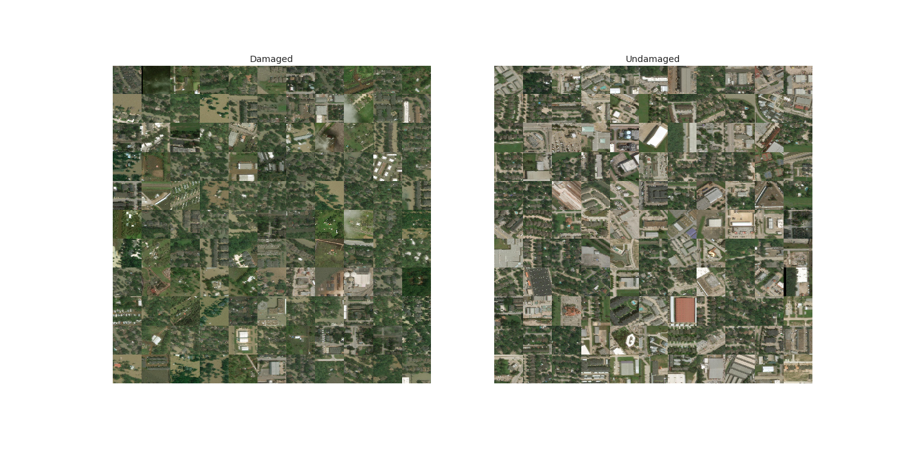
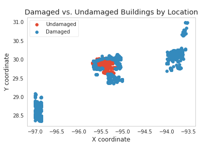
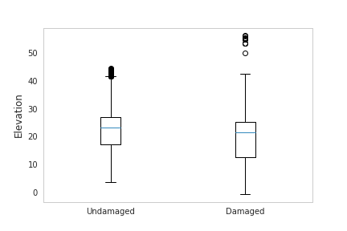
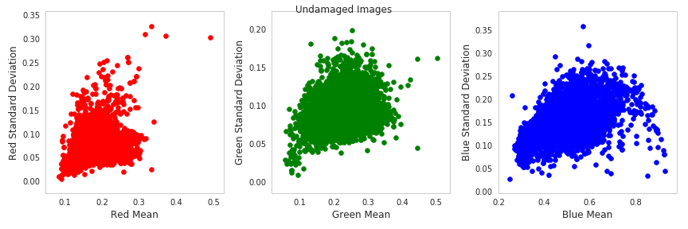
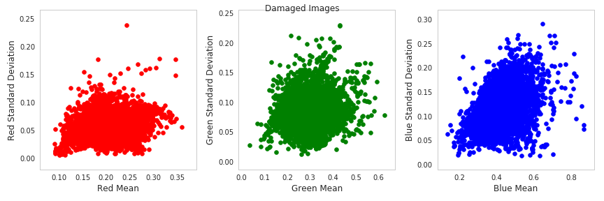
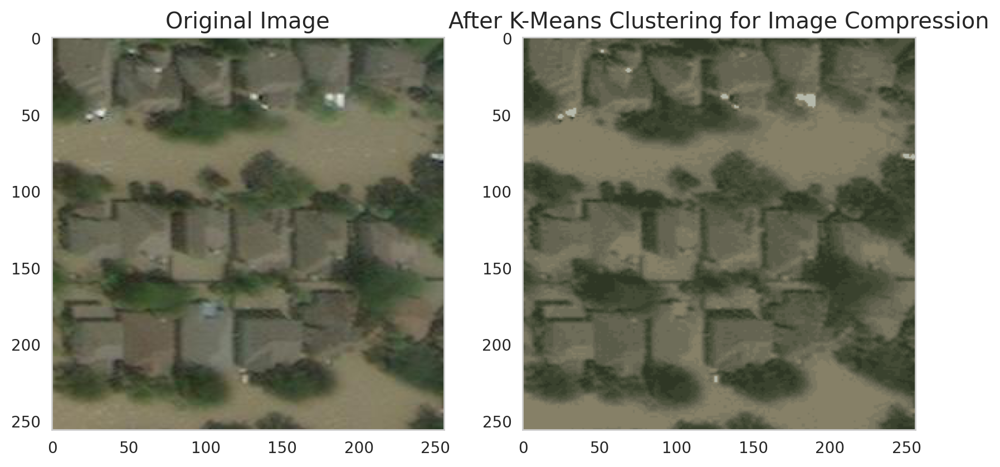

# Project Proposal

## Introduction and Background

Natural disaster zones are difficult to navigate, and it may take weeks or months to understand the full scope of structural and human damage. The recent earthquake in Turkey highlights this sobering reality; the death toll continued to rise each day, and experts were working on determining the scope and scale of the tragedy for weeks afterwards. An efficient and accurate classification model could take readily available satellite imagery from natural disaster-affected areas and classify structures with or without damage. This could greatly increase the speed of response and decrease risk for relief workers who now have a more accurate picture of the most dangerous and damaged areas. It could also let home and business owners know quickly how their properties fared to begin processing insurance claims and regaining their lives and livelihoods. 

Previous research has highlighted the effectiveness of neural networks as they reduce high dimensionality of images without losing information and demonstrate high accuracy in detecting post-disaster building and vegetation damage 1, 2, 3. Existing damage classification models also incorporate additional features like geolocation data and flood risk index to provide a highly granular map of damage.  4 

## Problem Definition and Dataset

In this project, we aim to: 

1.	Accurately classify damaged and undamaged buildings from post-hurricane satellite imagery  
2.	Test generalizability of our classification model on other post-disaster datasets 

## Data Collection

For this project, we are working with two large image datasets. The main dataset was sourced from a research paper titled, “Post-Hurricane Damage Assessment Using Satellite Imagery and Geolocation Features”  4  and comprises of around 24,000 unique, RGB satellite images depicting structures in the aftermath of Hurricane Harvey. These images are pre-labeled to indicate damaged and undamaged buildings and the size of the images is consistent at 250 x 250 pixels. Along with the image data provided, we have geolocation data that includes: 

    1. Distance from the nearest water body 

    2. Building elevation  

    3. X and Y coordinates of the buildings 

After downloading the dataset, we conducted data exploration in a Kaggle notebook before accessing the dataset via the Kaggle API in a Google Colab notebook for pre-processing and model building. 

We intend on testing the model’s generalizability on other post-disaster images now that we’ve built a supervised classification model on the Hurricane Harvey image dataset. For this task, we are using Stanford’s xBD building dataset  5,6  which consists of over 59,000 pre- and post-hurricane images that span a range of geographies and natural disasters. The images come with building polygons, ordinal labels of damage level, and corresponding satellite metadata. Additionally, the dataset contains bounding boxes and labels for environmental factors such as fire, water, and smoke. 

While there is a manageable amount of pre- and post-hurricane images in the xBD dataset, the entire dataset contains over 850,000 building polygons. Our challenge was finding a suitable work environment to filter through this data. We attempted to load and unzip the data files on Georgia Tech’s Phoenix Supercomputer’s PACE cluster but quickly reached the storage quota as the size of the entire dataset is 140GB. Our local systems and free workspaces such as Kaggle and Colab weren’t able to handle the massive dataset as well. Hence after updating Colab, we loaded the entire 140GB dataset and started exploring it. 

## Methods

As the image dataset we’ve selected is pre-labelled, we constructed a Convolutional Neural Network (CNN) in PyTorch for the purpose of image classification. In the hidden layers of the network, ReLU was used as the activation function. Our model incorporates a mixture of dense layers, max pooling, convolutional 2D, and flattening to classify our images. Please find below a description of the layers: 

    - 4 convolution layers with stride as 1 and padding as a 2-dimensional matrix with values as 1 
    - 4 layers of max pooling 
    - 5 ReLU activation layers 
    - 2 linear layers 
    - In the final layer, we switched the activation function to Sigmoid so as to convert the model’s output into a probability score that estimates the likelihood that a given image belongs to a specific classification 
    
As the images can take only two different labels (damaged and undamaged), we chose Binary Cross Entropy as our loss function. The optimizer that we chose was RMSprop, as it increases the learning rate and allows the model to converge faster.  

Given the computational needs of the model, we opted to use the GPU feature of Colab and used the CUDA toolkit for this purpose. We then split the images into a train, validation, and test set with a 60%, 20%, and 20% distribution, respectively. Each set was equally balanced with images of damaged buildings and images of undamaged buildings to avoid model biases. We chose to run for a total of 10 epochs as we didn’t want to risk overfitting the model and were getting strong performance on the validation dataset at the end of 10 epochs.  

## Results and Discussion

### Data Exploration:

**Hurricane Harvey Dataset -**

An initial look at the damaged and undamaged Hurricane Harvey images does not reveal a clear visual distinction between the two types of images, although it appears that many of the damaged images may show standing bodies of water around the houses. The dataset is close to balanced, with 13,933 damaged images and 10,384 undamaged images. All images are of the same dimensions. 

We explored the geolocation features associated with the image set and found that both damaged and undamaged buildings appear at similar coordinates. 

In addition, we found that there was not a statistically significant difference in elevation between damaged and undamaged buildings

Finally, we explored color features of our images to investigate whether there were visible color differences between damaged and undamaged building images. It appears that there's a higher mean value of red pixels in damaged building images, but otherwise the distributions appear similar.

**xBD Dataset - **

We started with sampling some images to understand the potential errors of the model we will build in the next step of this project. There were difficulties working with the TIF image format, which was the format of all the images in the dataset. The Python Imaging Library does not support multi-channel 32-bit TIF images so we used NumPy to create an array of RGB values. We then were able to plot this array using matplotlib.

    

The first image is pre-Hurricane Florence and the second image is post-Hurricane Florence.

Once we had the images, we created a table representing the essential information of each image:  

    1. Pre/Post disaster label 
    2. Geographical coordinates 
    3. Sun elevation 
    4. GSD (Ground Sampling Distance) 
    5. Quantification of no damage/major damage/minor damage/destroyed. 
    
The geographical coordinates will be important in ensuring that our model is classifying the data by damage rather than location of the data. Variables such as the sun elevation and the solar azimuth angle will be key indicators in detecting damage. An interesting column is GSD, which gives us an idea of the spatial resolution of the images. Finally, the quantification of damage will serve as the labels of our data. During training, we must normalize the images to a certain set resolution. To help with that, we plotted the resolution of images based on the disaster it corresponded to: 

    

We also charted the number of images per disaster as it guides us to how large our dataset of solely hurricane images will be:

    

We see that Hurricane Michael and Hurricane Florence have the highest number of images available. We are naturally ignoring the images from Hurricane Harvey as we’ve trained our model using these images.  

### Data Cleaning and Preprocessing:  

**Hurricane Harvey Dataset -**
We rescaled all images from 250 x 250 pixels to 150 x 150 pixels to reduce the training time of our deep learning classification model. We then normalized our images by pixel density to scale the pixel values between 0 and 1, as network training convergence depends on the normalized values.  

Next, we tested two data preprocessing techniques: PCA and K-Means clustering for image compression. The goal was to decrease model training time by reducing the total number of pixels in each image. K-Means image compression was theoretically successful, and reducing the images to just ten clusters while maintaining most important image features: 

However, both methods were extremely computationally intensive given the size and scale of our dataset, and we lacked the computing resources to execute them successfully. Ultimately, we concluded that even if these compression techniques led to decreased model training times, this approach would be net negative for time and computing resources compared to training the model on the uncompressed images given the extensive computing power required to compress the images. Finally, we converted the images to a tensor for use in our CNN model.

### Model Evaluation and Validation: 

Next, we normalized our image data to ensure pixel intensity was scaled between 0 and 1 and conducted PCA. (ADD STUFF ABOUT THIS LATER)

With the classification model, we hope to obtain results where images are accurately classified into one of the sub-categories. To measure its performance, we will use the accuracy and F1-score functions. For the clustering model, we will use elbow method for number of cluster selection and silhouette scores and Davies-Bouldin Index for tuning. 

When testing generalizability, we expect to see a decrease in the F1 score. Previous research suggests that generalizing the model to identify damage from new disasters is challenging for various reasons, like differing pixel distributions. In addition, the clustering algorithm may recognize hidden features, e.g., geographical coloring, which may not be related to building presence. 

## Timeline and Responsibility Distribution

## Team Contribution to the Project Proposal

## References
1. Berezina, Polina and Desheng Liu. “Hurricane damage assessment using couple convolutional neural networks: a case study of hurricane Michael.” Geomatics, Natural Hazards and Risks: pp. 414-31. 2021.

2. Chen, Xiao. “Using Satellite Imagery to Automate Building Damage Assessment: A case study of the xBD dataset.” Department of Civil and Environmental Engineering, Stanford University, Stanford, CA. 2021.

3. Khajwal, Asim B., Chih-Shen Cheng, and Arash Noshadravan. “Multi-view Deep Learning for Reliable Post-Disaster Damage Classification.” ArxIv, Cornell University. 2022.

4. Cao, Quoc Dung and Youngjun Choe. “Post-Hurricane Damage Assessment Using Satellite Imagery and Geolocation Features.” Department of Industrial and Systems Engineering, University of Washington, Seattle, WA. 2020.

## Datasets

Quoc Dung Cao, Youngjun Choe. "Detecting Damaged Buildings on Post-Hurricane Satellite Imagery Based on Customized Convolutional Neural Networks." IEEE Dataport. 2018.

Gupta, Ritwik and Hosfelt, Richard and Sajeev, Sandra and Patel, Nirav and Goodman, Bryce and Doshi, Jigar and Heim, Eric and Choset, Howie and Gaston, Matthew. “xBD: 
A Dataset for Assessing Building Damage from Satellite Imagery.” arXiv. 2019.

