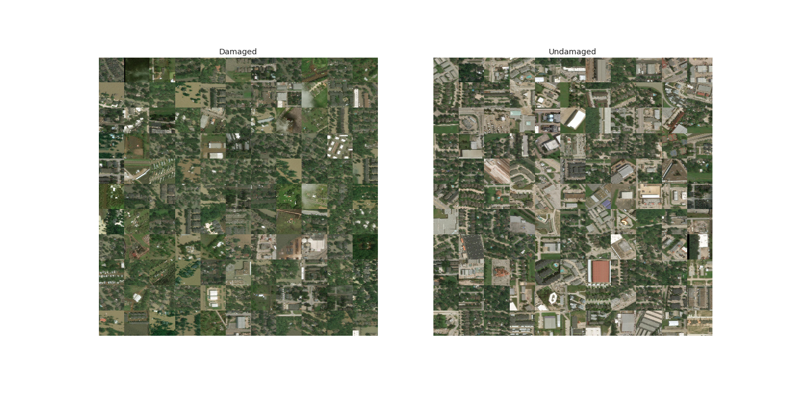
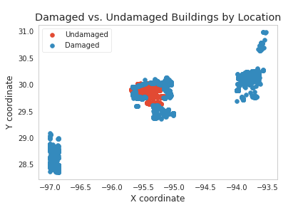
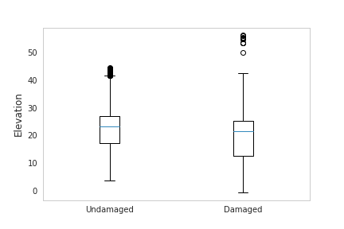
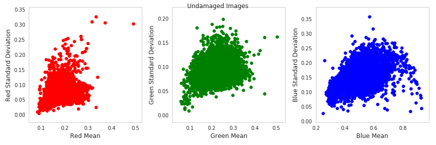
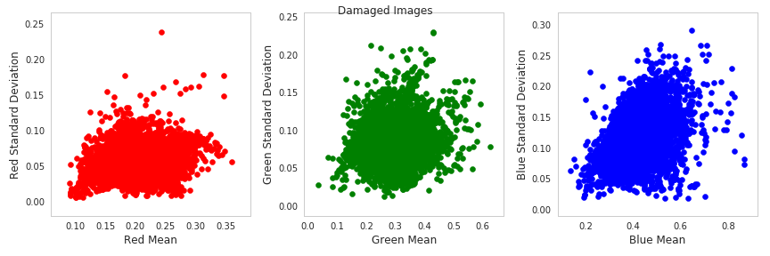
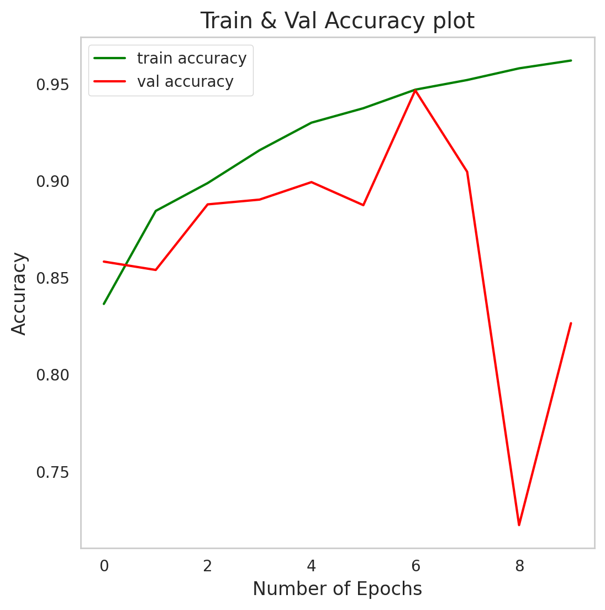
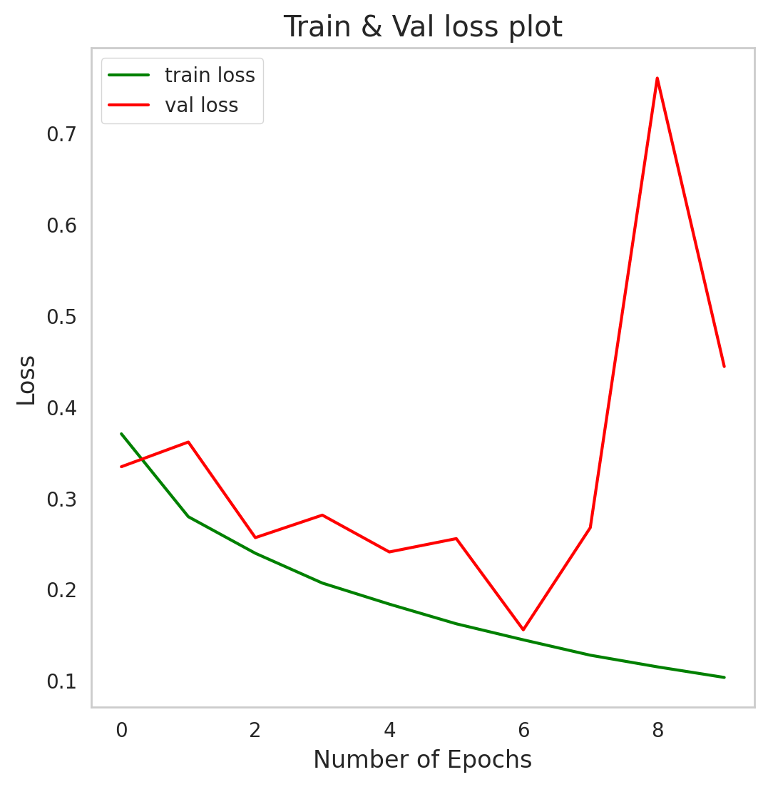

# Machine Learning Project Final Report

## Introduction and Background

Natural disaster zones are difficult to navigate, and it may take weeks or months to understand the full scope of structural and human damage in the wake of a disaster. The recent earthquake in Turkey highlights this sobering reality; the death toll continued to rise each day, and experts were working on determining the scope and scale of the tragedy for weeks afterwards. An efficient and accurate classification model could take readily available satellite imagery from natural disaster-affected areas and classify structures with or without damage. This could greatly increase the speed of response and decrease risk for relief workers who now have a more accurate picture of the most dangerous and damaged areas. It could also let home and business owners know quickly how their properties fared to begin processing insurance claims and regaining their lives and livelihoods.

Previous research has highlighted the effectiveness of neural networks as they reduce high dimensionality of images without losing information and demonstrate high accuracy in detecting post-disaster building and vegetation damage 1, 2, 3. Existing damage classification models also incorporate additional features like geolocation data and flood risk index to provide a highly granular map of damage.  4 

## Problem Definition

In this project, we aim to: 

1.	Accurately classify damaged and undamaged buildings from post-hurricane satellite imagery  
2.	Test generalizability of our classification model on other post-disaster datasets 

## Data Collection

For this project, we are working with two large image datasets. The main dataset was sourced from a research paper titled, “Post-Hurricane Damage Assessment Using Satellite Imagery and Geolocation Features”  4  and comprises of around 24,000 unique, RGB satellite images depicting structures in the aftermath of Hurricane Harvey. These images are pre-labeled to indicate damaged and undamaged buildings and the size of the images is consistent at 250 x 250 pixels. Along with the image data provided, we have geolocation data that includes: 

1. Distance from the nearest water body 
2. Building elevation  
3. X and Y coordinates of the buildings 

In addition, we used Stanford’s xBD building dataset 2 which consists of over 59,000 pre- and post-disaster images that span a range of geographies and natural disasters. The images come with building polygons, ordinal labels of damage level, and corresponding satellite metadata. Additionally, the dataset contains bounding boxes and labels for environmental factors such as fire, water, and smoke. After filtering for only pre- and post-hurricane images with buildings, we used a subset of 701 images in our generalizability dataset.

## Methods

### Model 1: Supervised Image Classification - CNN

As the image dataset we’ve selected is pre-labelled, we constructed a Convolutional Neural Network (CNN) in PyTorch for the purpose of image classification. In the hidden layers of the network, ReLU was used as the activation function. Our model incorporates a mixture of dense layers, max pooling, convolutional 2D, and flattening to classify our images. Please find below a description of the layers:

\begin{itemize}
  \item 4 convolution layers with stride as 1 and padding as a 2-dimensional matrix with values as 1
  \item 4 layers of max pooling
  \item 5 ReLU activation layers
  \item 2 linear layers
  \item In the final layer, we switched the activation function to Sigmoid so as to convert the model’s output into a probability score that estimates the likelihood that a given image belongs to a specific classification
\end{itemize}

As the images can take only two different labels (damaged and undamaged), we chose Binary Cross Entropy as our loss function. The optimizer that we chose was RMSprop, as it increases the learning rate and allows the model to converge faster.

Given the computational needs of the model, we opted to use the GPU feature of Colab and used the CUDA toolkit for this purpose. We then split the images into a train, validation, and test set with a 60%, 20%, and 20% distribution, respectively. Each set was equally balanced with images of damaged buildings and images of undamaged buildings to avoid model biases. We chose to run for a total of 10 epochs as we didn’t want to risk overfitting the model and were getting strong performance on the validation dataset at the end of 10 epochs.

#### Hyperparameter tuning: 
In order to optimize the performance of our CNN model, we conducted a comprehensive hyperparameter tuning process. This process involved fine-tuning various hyperparameters to achieve the best possible accuracy, while minimizing overfitting and maintaining a reasonable training time. The main hyperparameters we considered included the number of epochs, batch size, learning rate, and optimization algorithms.
•	Number of epochs: We experimented with different numbers of training epochs to find a balance between model convergence and overfitting
•	Batch size: We explored various batch sizes to strike a balance between computational efficiency and the ability of the model to learn from the data
•	Learning rate: We investigated different learning rates to ensure the model's convergence and stability during training
•	Optimization algorithms: We experimented with two optimization algorithms, RMSprop, and Adam, to find the one that best suited our model's architecture and dataset
•	Model architecture: We also played around with the number of convolutional layers and filter sizes

#### Model regularization:
After creating our baseline model, we tested regularization techniques to develop a more generalizable model. First we added random transformations in the form of random rotations, horizontal flips, vertical flips, color brightness, contrast, saturation, and hue, and added random perspective distortions. We also tested adding dropout layers and tested a range of dropout probabilities, ranging from .01 – 0.5 dropout probability and normalization transformations from 1-5 to the weight vectors, to find the optimum dropout probability and model weights. Finally, we tried L2 regularization by adding penalty terms to the loss function.

### Model 2: Supervised Image Classification - Multi-Modal Model

In addition to this baseline model, we also developed a model that incorporated both geolocation data and image features. There are 3 components to this multi-modal model:

1.	CNN: The CNN is used to extract features from the input images. It comprises a sequence of four convolutional layers, followed by ReLU activation functions and max-pooling layers. After the last max-pooling layer, the output is flattened and passed through a fully connected layer with 512 neurons and a ReLU activation function
2.	Geolocation encoding module: This module processes the geolocation features, which are distance and elevation in this case. It consists of two fully connected layers with 8 and 4 neurons, respectively, followed by ReLU activation functions
3.	Fusion layers: The fusion layers are responsible for combining the outputs from the CNN and the geolocation encoding sub-module. The concatenated output is passed through a sequence of three fully connected layers with 256, 128, and 1 neurons, respectively. The final output is a single value between 0 and 1, representing the probability of a positive class. The sigmoid activation function is applied to the last layer to achieve this.

The training loop includes computing the loss using Binary Cross-Entropy Loss (BCELoss) and optimizing the model parameters using the RMSprop optimizer. After training, the model is evaluated on a test dataset, and the test loss and accuracy are computed to assess the model's performance.

We observe that the improvement in test accuracy using the multi-model model is not substantial. However, the performance on the validation dataset is more consistent, indicating a potentially more reliable model. Considering the considerable effort needed to gather distance and elevation data, we have decided to proceed with a model that solely utilizes image features. This approach will streamline the data collection process and still provide us with a reasonably accurate and stable model for our application.

### Model 3: Image Compression

The images that we’re working with in the Hurricane Harvey dataset are sized at 256 x 256 x 3 pixels and in the xBD dataset, they are larger at a size of 1024 x 1024 x 3 pixels each. While the size of each image isn’t too large to handle on our systems, a compressed image helps reduce the redundancy in the image data and allows us to build more efficient models.

To compress the images, we constructed a Deep CNN Autoencoder. Autoencoders work perfectly for this purpose as they transform input data from a high-dimensional space to low-dimensional space by reducing the noise in it. Every autoencoder is composed of an encoder that receives the input and compresses it into a latent-space representation. This representation is then passed to the decoder that reconstructs the input. 

Before passing our images into the autoencoder, we converted each of them from color to grayscale. This was done to reduce the number of dimensions in the image and improve the effectiveness of the compression we intended to do. The layers of our autoencoder look like:

1.	Encoder - 
•	2 convolution layers with stride as 2, kernel as 3, activation function as ReLU and padding as a 3-dimensional matrix
2.	Decoder - 
•	2 transposed convolution layers stride as 2, kernel as 3, activation function as ReLU and padding as a 3-dimensional matrix
•	1 convolution layer with an activation function as Sigmoid

As we are interested in understanding the difference between the original image and compressed image, we chose Mean Squared Error as the loss function. 

This model was also computationally expensive, so we opted to use the GPU feature of Colab along with the CUDA toolkit. We used the same train and test set from the supervised model and ran the compression model for a total of 10 epochs. The model ultimately produced compressed images in the form of arrays that could be used for any further modelling.

### Model 4: Unsupervised Auto-labeler

The original Hurricane Harvey image dataset comes with labels that classify the images into those with damaged buildings and those with undamaged buildings. This dataset was convenient for solving our problem statement however this prompts the question that when provided a dataset of unlabeled data, how would a disaster relief organization use a solution like this to support their efforts?

To tackle this issue, we constructed a clustering algorithm that would group images with damaged buildings into one cluster and create another cluster with images of undamaged buildings. This model would act as an auto-labeler where the user could feed in unlabeled images and receive an output of images clustered into their respective labels. 

For the clustering task, we used KMeans Clustering on the compressed image arrays obtained from the previous model. As KMeans Clustering only works with data having a dimension less than or equal to two, we reshaped the arrays from (X, Y, Z) to (X, Y*Z) where X refers to the total number of images, Y is the total number of rows in a single image array and Z is the total number of columns in an image array. We set the total number of clusters to two and applied the algorithm.  

### Model 5: Generalizability on XBD Dataset
Using the aforementioned Stanford xBD dataset, we built a pipeline to test the generalizability of our described neural network architecture. 

First, we needed to isolate the images corresponding to a hurricane, as the dataset initially contained images from various disaster types. Then, we needed to isolate images that contain buildings in them. We were able to do this as each image had a corresponding detailed description in JSON format, containing information about the level of damage and, most importantly, the presence of a building. Finally, the most challenging aspect of this model, we needed to convert the ‘tiff’ image files, the format of the xBD Dataset images, to ‘jpeg’ files, the desired input format of the PyTorch model object trained on the Hurricane Harvey dataset. 

The xBD dataset had 4 labels (no damage, minor damage, major damage, destroyed); we condensed degrees of damage into a single category. Finally, we loaded the PyTorch model object trained on the Hurricane Harvey dataset ad tested model generalizability on the test dataset.

## Results and Discussion

### Data Exploration:

**Hurricane Harvey Dataset -**

An initial look at the damaged and undamaged Hurricane Harvey images does not reveal a clear visual distinction between the two types of images, although it appears that many of the damaged images may show standing bodies of water around the houses. The dataset is close to balanced, with 13,933 damaged images and 10,384 undamaged images. All images are of the same dimensions. 

We explored the geolocation features associated with the image set and found that both damaged and undamaged buildings appear at similar coordinates. 

In addition, we found that there was not a statistically significant difference in elevation between damaged and undamaged buildings

Finally, we explored color features of our images to investigate whether there were visible color differences between damaged and undamaged building images. It appears that there's a higher mean value of red pixels in damaged building images, but otherwise the distributions appear similar.

**xBD Dataset -**

We started with sampling some images to understand the potential errors of the model we will build in the next step of this project. There were difficulties working with the TIF image format, which was the format of all the images in the dataset. The Python Imaging Library does not support multi-channel 32-bit TIF images so we used NumPy to create an array of RGB values. We then were able to plot this array using matplotlib.

    

The first image is pre-Hurricane Florence and the second image is post-Hurricane Florence.

Once we had the images, we created a table representing the essential information of each image:  

1. Pre/Post disaster label 
2. Geographical coordinates 
3. Sun elevation 
4. GSD (Ground Sampling Distance) 
5. Quantification of no damage/major damage/minor damage/destroyed. 
    
The geographical coordinates will be important in ensuring that our model is classifying the data by damage rather than location of the data. Variables such as the sun elevation and the solar azimuth angle will be key indicators in detecting damage. An interesting column is GSD, which gives us an idea of the spatial resolution of the images. Finally, the quantification of damage will serve as the labels of our data. During training, we must normalize the images to a certain set resolution. To help with that, we plotted the resolution of images based on the disaster it corresponded to: 

    

We also charted the number of images per disaster as it guides us to how large our dataset of solely hurricane images will be:

    

We see that Hurricane Michael and Hurricane Florence have the highest number of images available. We are naturally ignoring the images from Hurricane Harvey as we’ve trained our model using these images.  

### Data Cleaning and Preprocessing:  

**Hurricane Harvey Dataset -**
We rescaled all images from 250 x 250 pixels to 150 x 150 pixels to reduce the training time of our deep learning classification model. We then normalized our images by pixel density to scale the pixel values between 0 and 1, as network training convergence depends on the normalized values.  

Next, we tested two data preprocessing techniques: PCA and K-Means clustering for image compression. The goal was to decrease model training time by reducing the total number of pixels in each image. K-Means image compression was theoretically successful, and reducing the images to just ten clusters while maintaining most important image features: 

However, both methods were extremely computationally intensive given the size and scale of our dataset, and we lacked the computing resources to execute them successfully. Ultimately, we concluded that even if these compression techniques led to decreased model training times, this approach would be net negative for time and computing resources compared to training the model on the uncompressed images given the extensive computing power required to compress the images. Finally, we converted the images to a tensor for use in our CNN model.

### Model Evaluation and Validation: 

We used a threshold of 0.5 for calculating the accuracy metric.  After running the model for 10 epochs, we observed the following: 

**Train and Validation Accuracy -** 

The above graph shows the accuracy of the model as a function of epoch. We see that the train accuracy continues to increase as well as the validation accuracy with the exception of the eighth epoch. 

**Train and Validation Loss -** 

The above graph shows the loss of the model as a function of epoch. We again see that the train loss decreases along with the validation loss with the exception of the eighth epoch. One reason for why the eighth epoch is showing such results may be due to overfitting of the model. The model may be learning patterns in the training data that cannot be generalized for the validation data set. Some methods we could take to avoid such overfitting could be weight regularization, adding dropout layers or data augmentation. 

Upon running our model on the test dataset, we noted an accuracy of 0.8374.

### Next Steps: 

In Phase 2, we will explore adding geolocation data as features to our Hurricane Harvey model to see if it improves performance. In addition to feature adding and selection, we will also take care of weight regularization and add dropout layers. In addition, we will implement data augmentation techniques to further improve the generalizability of the model. For example, we intend to experiment with adjusting the light level, the brightness of the image, cropping the image, rotating, transforming, flipping the image, and other techniques.   

In Phase 2 we will implement a clustering model to identify images in the xBD dataset with buildings present. We will also test the generalizability of our Hurricane Harvey model on this dataset and compare performance and how well our model does on datasets that it has not seen. 

## Timeline and Responsibility Distribution

## Team Contribution to the Project Midterm Report

## References
1. Berezina, Polina and Desheng Liu. “Hurricane damage assessment using couple convolutional neural networks: a case study of hurricane Michael.” Geomatics, Natural Hazards and Risks: pp. 414-31. 2021.

2. Chen, Xiao. “Using Satellite Imagery to Automate Building Damage Assessment: A case study of the xBD dataset.” Department of Civil and Environmental Engineering, Stanford University, Stanford, CA. 2021.

3. Khajwal, Asim B., Chih-Shen Cheng, and Arash Noshadravan. “Multi-view Deep Learning for Reliable Post-Disaster Damage Classification.” ArxIv, Cornell University. 2022.

4. Cao, Quoc Dung and Youngjun Choe. “Post-Hurricane Damage Assessment Using Satellite Imagery and Geolocation Features.” Department of Industrial and Systems Engineering, University of Washington, Seattle, WA. 2020.

## Datasets

Quoc Dung Cao, Youngjun Choe. "Detecting Damaged Buildings on Post-Hurricane Satellite Imagery Based on Customized Convolutional Neural Networks." IEEE Dataport. 2018.

Gupta, Ritwik and Hosfelt, Richard and Sajeev, Sandra and Patel, Nirav and Goodman, Bryce and Doshi, Jigar and Heim, Eric and Choset, Howie and Gaston, Matthew. “xBD: 
A Dataset for Assessing Building Damage from Satellite Imagery.” arXiv. 2019.

